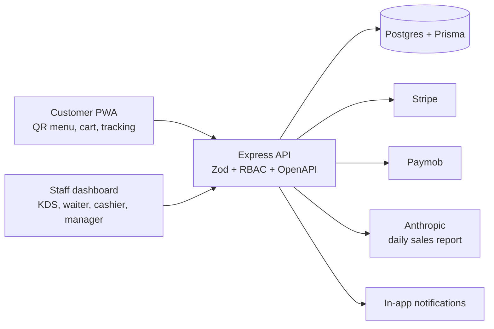

# Restaurant POS + QR Ordering

A full-stack restaurant point-of-sale with QR-code customer ordering, live
kitchen/waiter screens, inventory with recipe auto-deduction, coupons,
loyalty points, online payments (Stripe + Paymob), sales analytics, AI daily
reports, reservations, split bills with tips, refunds with approval, and a
fraud-audit trail.

## Demo (2 minutes)

```bash
docker compose up -d
pnpm install
pnpm db:deploy
pnpm db:seed
pnpm dev
```

- Staff app: http://localhost:5173 (login `owner@demo.local` / `Demo1234!`)
- Customer menu: scan a table QR from the Tables page, or open
  `http://localhost:5173/public/menu/tbl_demo_1`
- API + Swagger: http://localhost:3000/api/docs

More demo logins (same password `Demo1234!`): `manager@demo.local`,
`cashier@demo.local`, `waiter@demo.local`, `kitchen@demo.local`.

Screenshots: [dashboard](docs/screenshots/dashboard.png) ·
[kitchen](docs/screenshots/kds.png) · [customer menu](docs/screenshots/menu.png)
*(placeholders — record your own 2–3 min walkthrough).*

## Features by phase

| Phase | What | Status |
|---|---|---|
| 1–3 | Auth/RBAC, menu, tables + QR, customer ordering, KDS, waiter view | Done |
| 4 | Ingredients, recipes, auto-deduct on PREPARING, low-stock alerts | Done |
| 5 | Coupons (validate + apply at checkout), loyalty (tiers, expiry) | Done |
| 6 | Stripe PaymentIntents + webhook, Paymob iframe + HMAC callback | Done |
| 7 | Analytics (top products, revenue trends, stock) + AI daily reports | Done |
| 8 | Reservations, split bills + tips, refunds + audit log | Done |
| 9 | Docker, CI, seed, docs | Done |

## Tech stack

| Layer | Choice |
|---|---|
| Monorepo | pnpm workspaces + Turbo |
| Backend | Node 22, Express 5, TypeScript, Zod, JWT + refresh rotation |
| DB | PostgreSQL 17 + Prisma 7 |
| Frontend | React 19, Vite, TanStack Query, React Router, Recharts |
| Realtime | Polling (10–30s) on KDS/waiter/queue screens |
| Payments | Stripe SDK, Paymob Accept API (both optional via env) |
| AI reports | Anthropic Messages API (optional via env), node-cron daily job |
| Deploy | Docker Compose (dev + prod), GitHub Actions CI |

## Project structure

```text
apps/
  backend/    Express API (modules: auth, users, menu, orders, payments,
              inventory, coupons, loyalty, analytics, reports, …)
  frontend/   Staff dashboard + customer PWA (features per domain)
packages/
  database/   Prisma schema, migrations, seed, shared client
docs/         API / Architecture / ERD / Roadmap notes
```

## Architecture



Clean-architecture slice per module:
`routes → controllers → use-cases → repositories → Prisma`.
Use-cases are unit-tested with mocked repositories; business flows have
supertest integration tests against a real database.

## Scripts

| Command | What |
|---|---|
| `pnpm dev` | Run everything (Turbo) |
| `pnpm build` / `pnpm typecheck` / `pnpm lint` | Build / types / lint |
| `pnpm test` | All Vitest suites |
| `pnpm db:generate` / `db:migrate` / `db:deploy` | Prisma client / dev migration / prod migrate |
| `pnpm db:seed` | Demo dataset (idempotent, history only on empty DB) |
| `pnpm db:studio` | Prisma Studio |

## Environment

Copy values into `apps/backend/.env` and `packages/database/.env`
(`DATABASE_URL` must match `docker-compose.yml`, host port **5433**):

| Variable | Required | Purpose |
|---|---|---|
| `DATABASE_URL` | Yes | Postgres connection string |
| `JWT_ACCESS_SECRET` / `JWT_REFRESH_SECRET` | Yes | Token signing |
| `STRIPE_SECRET_KEY` / `STRIPE_WEBHOOK_SECRET` | No | Online cards (Stripe) |
| `PAYMOB_API_KEY` / `PAYMOB_INTEGRATION_ID` / `PAYMOB_IFRAME_ID` / `PAYMOB_HMAC_SECRET` | No | Online cards (Paymob) |
| `ANTHROPIC_API_KEY` | No | AI daily sales report |
| `LOYALTY_AMOUNT_PER_POINT` (default 10), `LOYALTY_POINT_EXPIRY_MONTHS` (12), `LOYALTY_SILVER_THRESHOLD` (500), `LOYALTY_GOLD_THRESHOLD` (2000) | No | Loyalty tuning |
| `REPORT_CRON` (default `0 6 * * *`) | No | Daily report schedule |

Unconfigured providers/endpoints fail gracefully (`PAYMENT_PROVIDER_NOT_CONFIGURED`,
`AI_PROVIDER_NOT_CONFIGURED`) — the app boots and runs without any keys.

## Production deploy

```bash
POSTGRES_PASSWORD=... JWT_ACCESS_SECRET=... JWT_REFRESH_SECRET=... \
  docker compose -f docker-compose.prod.yml up -d --build
docker compose -f docker-compose.prod.yml exec backend \
  pnpm --filter @restaurant/database seed
```

The frontend is served by nginx and proxies `/api/*` to the backend;
Swagger is off by default in production (`SWAGGER_ENABLED=false`).

## API

Interactive docs at `/api/docs` (dev). Envelope: `{ success, data }` plus
`{ pagination }` on list endpoints; errors are `{ success: false, error:
{ code, message } }` with stable `CODE_UPPER_SNAKE` codes the UI maps to
friendly messages.

## Tests

- Backend: ~390 Vitest tests (unit per use-case + supertest business flows,
  incl. payment concurrency and webhook signature tests).
- Frontend: component + page tests with MSW; `oxlint`; `tsc -b`.
- CI (`.github/workflows/ci.yml`) runs typecheck, backend tests, frontend
  lint/tests, and builds both Docker images on push to `main`.
